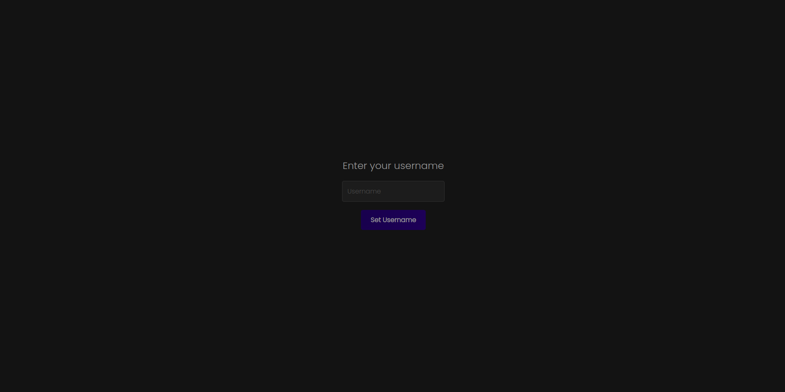
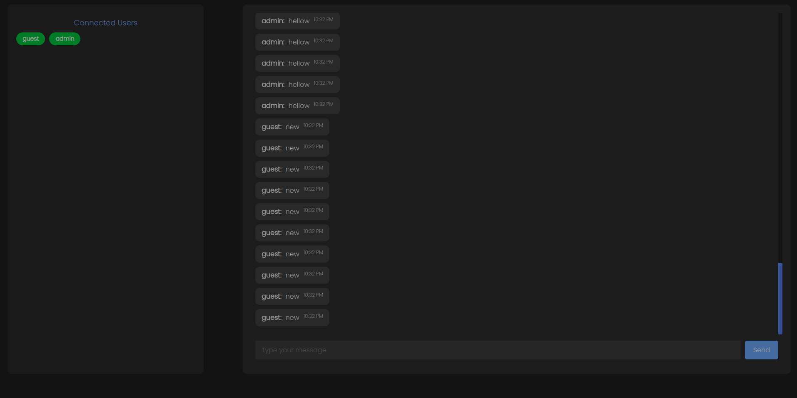

# Chat Application

This is a simple, real-time chat application built using **Node.js**, **WebSocket**, and **MongoDB** for the backend and **Materialize CSS** for the frontend, following **Material Design** principles. The application allows users to enter a username, join a chat room, and communicate with other users in real time.

## Table of Contents

- [Features](#features)
- [Technologies](#technologies)
- [Prerequisites](#prerequisites)
- [Project Structure](#project-structure)
- [Setup Instructions](#setup-instructions)
- [Running the Application](#running-the-application)
- [Docker Instructions](#docker-instructions)
- [Screenshots](#screenshots)

## Features

- **Real-time Chat**: Users can send and receive messages in real-time.
- **WebSocket Communication**: The app uses WebSocket for instant messaging without page reloads.
- **Material Design**: The frontend is styled using Materialize CSS, following Material Design principles.
- **User Management**: The application displays the list of currently connected users.
- **MongoDB Storage**: Chat history is stored in MongoDB and loaded for new users upon connection.

## Technologies

- **Frontend**:
  - HTML5, CSS3 (Material Design)
  - Materialize CSS for responsive and modern UI
- **Backend**:
  - Node.js (Express)
  - WebSocket for real-time communication
  - MongoDB for persistent chat storage
- **Docker**:
  - Containerization for easy deployment
  - Apache for serving frontend

## Prerequisites

Make sure you have the following installed on your system:

- [Node.js](https://nodejs.org/) (v14 or higher)
- [MongoDB](https://www.mongodb.com/) (installed locally or using Docker)
- [Docker](https://www.docker.com/) (optional for containerized setup)

## Project Structure

```bash
.
├── backend                  # Backend Node.js code
│   ├── index.js              # Main server code
│   ├── package.json          # Node.js dependencies
│   ├── Dockerfile            # Backend Dockerfile
│   └── ...
├── frontend                 # Frontend HTML/CSS code
│   ├── index.html            # Main frontend file
│   ├── style.css             # Custom styles
│   ├── Dockerfile            # Frontend Dockerfile (Apache)
├── docker-compose.yml        # Docker Compose file for the full app
└── README.md                 # Project documentation
```

## Setup Instructions

### 1. Clone the repository

```bash
git clone https://github.com/bhadri01/chat-application.git
cd chat-application
```

### 2. Set up the backend

Navigate to the `back-end` folder and install the Node.js dependencies:

```bash
cd backend
npm install
```

### 3. Configure MongoDB

Make sure MongoDB is running either locally or through Docker.

For a local MongoDB installation, the app will connect to `mongodb://localhost:27017/chatApp`. You can configure this in the `MONGO_URL` environment variable.

If using Docker, follow the Docker section below for instructions.

### 4. Set up the frontend

Navigate to the `front-end` folder. The frontend uses Materialize CSS, so no dependencies are required.

```bash
cd frontend
```

## Running the Application

### Running Locally

#### Backend:
1. Start the MongoDB service locally (if not using Docker).
2. Run the Node.js backend:

```bash
cd backend
node index.js
```

The backend will be running on `http://localhost:3000`.

#### Frontend:
You can serve the `front-end` folder through Apache, or open the `index.html` in a browser directly for local development.

1. Open the `front-end/index.html` file in a web browser.
2. It should connect to the backend WebSocket running at `ws://localhost:3000`.

### Docker Instructions

If you want to run the entire app in Docker containers, use the provided `docker-compose.yml` file.

#### 1. Build the containers:

```bash
docker compose build
```

#### 2. Run the containers:

```bash
docker compose up -d
```

This will start the following services:

- **frontend**: The frontend will be served by Apache at `http://localhost:8080`.
- **backend**: The Node.js backend will run at `http://localhost:3000`.
- **mongo**: The MongoDB instance will be available at `mongodb://mongo:27017/chatApp`.

You can now open `http://localhost:8080` in your browser to access the application.

### Building the Frontend with No Cache

To force a no-cache build of the frontend:

```bash
docker compose build --no-cache frontend
docker compose up
```

This will rebuild the frontend without using any cached layers.

## Screenshots

### Username Screen:


### Chat Page:


---

## License

This project is licensed under the MIT License.

---

## Contribution Guidelines

If you would like to contribute, feel free to submit a pull request or create an issue. All contributions are welcome!

---

## Contact

For any questions or issues, please reach out to the repository owner or submit an issue on GitHub.

---

This README provides comprehensive instructions for setting up and running the project locally or in Docker, with a clear overview of the project structure and functionality.